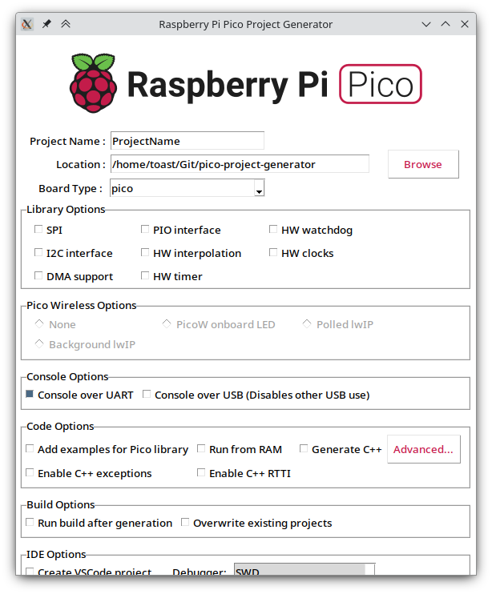
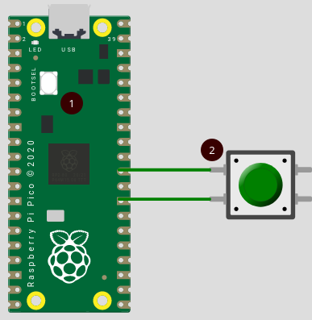

## Programming Software Setup

### Dev Envitonment

Nobara/Fedora 39 on a hand-me-down dual core dell laptop. An RPi Pico, programming over usb cable. Some wires, buttons, LEDs and resistors I <b>Borrowed</b> from lab.

### Code Editor
Instead of using Arduino IDE, I use Visual Studio Code for programming. I use it because I (seem to) write code more efficiently and because I have it customized it to my liking.

Extensions I use:
- C/C++ Extension Pack from ms-vscode
- CMake and CMake tools
- Vim
- My custom dark theme

### Project Generation

A C Pico project requires additional files to handle compilation: CMakeList.txt and pico_sdk_import.cmake, templates of both available in the installed pico sdk. To automate this, I am using [Pico Project Generator](https://github.com/raspberrypi/pico-project-generator) to generate the boilerplate code for the project. Most of the options are left default. The only changes are: `Console over USB` and `Create VSCode Project` are enabled.

### Uploading Code

Currently I program the pico over USB connection, and to do so, 
- the USB has to be unplugged
- The button on the board has to be held down to put the board into programming mode
- USB has to be plugged back in and the button can be released

This will wear-out the port upon time. To solve this, the `RUN` pin #30 can be pulled down/connect to `GND` to reset the board. I use a button to acomplish that, from now on called the reset button, as seen below.

So uploading the code requires following steps:

- Press and hold reset button (2)
- Press and hold bootloader button (1)
- Release reset button (2)
- Release bootloader button (1)

This will mount the pico as a storage device, to where the generated `.UF2` file should be copied.

## Hardware Setup

I have the RaspberryPi Pico Non-W variant: without the wireless chip. Soldered male jumper headers and mounted it onto a large breadboard. I am using solid copper wires for connections, because they stay in set shape.

I am using a button as mentioned above to upload the program.